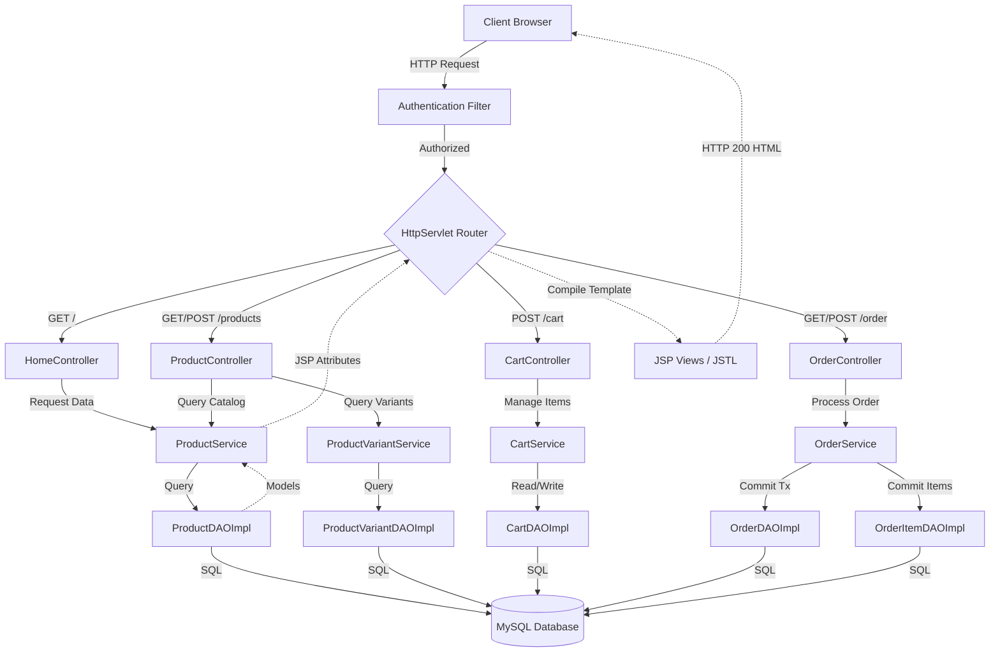
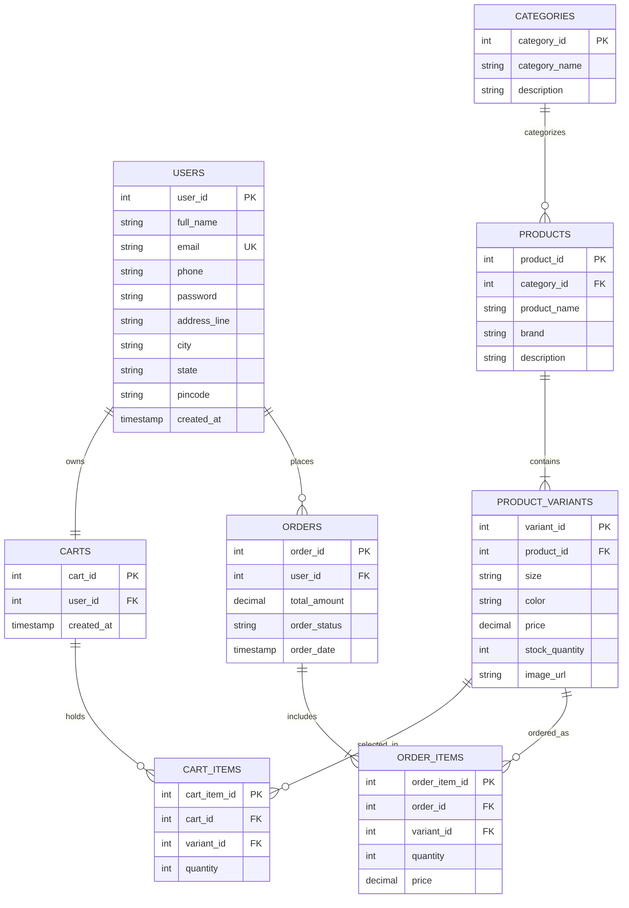

# FAGISTAR Fashion Store - Architectural Blueprint & Interview Preparation Guide

---

## Table of Contents
1. [Project Overview](#1-project-overview)
2. [Project Architecture](#2-project-architecture)
3. [Technology Stack](#3-technology-stack)
4. [End-to-End Development Process](#4-end-to-end-development-process)
5. [Complete Project Workflow](#5-complete-project-workflow)
6. [Database Design](#6-database-design)
7. [API Documentation](#7-api-documentation)
8. [Security Implementation](#8-security-implementation)
9. [Scalability and Performance](#9-scalability-and-performance)
10. [Challenges and Solutions](#10-challenges-and-solutions)
11. [Real Interview Explanation](#11-real-interview-explanation)
12. [Interview Questions and Answers](#12-interview-questions-and-answers)
13. [Resume Content](#13-resume-content)
14. [Presentation & Viva Prep](#14-presentation--viva-prep)
15. [Recruiter-Friendly Summary](#15-recruiter-friendly-summary)
16. [Formatting & References](#16-formatting--references)

---

# 1. Project Overview

### Project Name
**FAGISTAR Fashion Store** (Premium E-Commerce Platform)

### Project Objective
To design and implement a high-performance, dark-themed, premium digital storefront using Java Web Technologies (Jakarta Servlets, JSP, JDBC) and vanilla frontend styling. The platform delivers a premium, immersive shopping experience styled after Awwwards-winning websites, featuring hardware-accelerated transitions, interactive video elements, and real-time database-driven e-commerce operations.

### Problem Statement
Modern e-commerce applications are often bloated with massive frameworks (React, Next.js, Spring Boot) that obscure underlying request-response lifecycles, database connection pools, and thread management. This project addresses the need for a highly responsive, custom-tailored fashion portal built from foundational principles to ensure maximal execution efficiency, security, and developer control, while keeping design aesthetics at the luxury tier.

### Business Need
Traditional fashion storefronts struggle with user retention due to generic interfaces and slow page transitions. FAGISTAR addresses this by coupling high-end animations (such as Awwwards-style scroll scaling and custom cursor followers) with instant catalog retrieval, bridging the gap between luxury web art and dynamic commercial platforms.

### Target Users
- **Fashion-Conscious Shoppers**: Looking for premium clothing with a rich visual browsing experience.
- **Store Administrators**: Needing structured product management across categories (Men, Women, Kids) and accurate order tracking.

### Key Features
- **Dynamic Catalog Processing**: Fetches actual product prices, variants, sizes, and colors directly from MySQL using a transactional service layer.
- **Awwwards-Style Video Hero**: Programmatic autoplay background loops with dynamic scroll-driven scale expansion (from `0.92` to `1.0`) and interactive floating glassmorphic cursor feedback.
- **Integrated Shopping Cart & Checkout**: Interactive session-persistent cart with item additions, quantity management, stock checking, and transaction creation.
- **Security Interceptor Filter**: Session-based servlet filter protecting critical user routes (profile, cart, checkout) from unauthorized access.

### Expected Outcomes
- Sub-second catalog rendering times using clean, compiled Java bytecode on Apache Tomcat.
- 0% visual layout layout shifts (CLS) on the homepage.
- Secure, transactional order flow handling concurrent catalog purchases.

---

# 2. Project Architecture

The FAGISTAR Fashion Store follows a classic **Model-View-Controller (MVC) Architecture** decoupled into distinct logical layers:



### Request/Response Lifecycle Flow
1. **Client Interaction**: A user visits the catalog or clicks "Add to Cart". The browser dispatches an HTTP request.
2. **Filter Interception**: `AuthenticationFilter` checks if the route requires authorization and validates the user session.
3. **Servlet Routing**: The request hits the targeted servlet (e.g. `ProductController`), which parses request parameters.
4. **Service Invocation**: The Controller calls business methods in the Service layer (e.g. `ProductService.getProductById()`).
5. **Data Access (DAO)**: The service calls the DAO layer, which fetches a connection from `DBConnection` and executes parameterized queries.
6. **Model Mapping**: Database result sets are converted to Java POJOs (`Product`, `ProductVariant`).
7. **JSP Rendering**: The Controller forwards the request to the target JSP (e.g., `product-details.jsp`) after setting model attributes.
8. **HTML Delivery**: The JSP compiles into HTML and returns it to the client with a `200 OK` status.

---

# 3. Technology Stack

| Technology | Layer | Purpose | Advantage | Alternatives | Interview Explanation |
| :--- | :--- | :--- | :--- | :--- | :--- |
| **Java 17 (LTS)** | Core Backend | Application runtime and object-oriented backend programming. | Modern record support, strong type safety, high compilation speed. | Node.js, Python | Chosen to build a robust, thread-safe transactional business layer using compiled JVM bytecode. |
| **Jakarta Servlet API** | Controller | Web routing, handling HTTP requests and responses. | Standard Java web specification, low overhead, no boot-up bloat. | Spring Boot, Jersey | Servlets provide direct control over HTTP request lifecycle and session management without heavy framework magic. |
| **JSP & JSTL** | Presentation | Dynamic view generation using server-side template compilation. | Direct integration with Java servlet contexts, simple layout structuring. | Thymeleaf, FreeMarker | Compiles directly to Java servlets on the fly, rendering views server-side for clean initial loads. |
| **MySQL 9.3** | Database | Relational storage for products, variants, users, and orders. | Highly reliable, ACID compliance, optimized transaction support. | PostgreSQL, MongoDB | Chosen for strict relational integrity and fast indexing on primary keys to speed up product queries. |
| **JDBC** | Data Access | Raw SQL interaction from Java utilizing connection strings. | Maximum query execution speed, direct mapping control, no hidden queries. | Hibernate, JPA | Avoids the N+1 select problem and mapping overhead of heavy ORMs by executing raw, optimized PreparedStatements. |
| **Vanilla CSS3** | Presentation styling | Aesthetic layout, structural alignment, and premium visual styling. | No library dependencies, hardware-accelerated animations, full layout control. | TailwindCSS, Bootstrap | Allows customization of Awwwards-style animations (scroll-scale, custom cursors) without performance bottlenecks. |
| **Apache Tomcat 10** | Web Server | Servlet container that compiles JSPs and runs Servlet contexts. | Standard servlet compliance, lightweight, fast restart times. | Jetty, Glassfish | Industry standard container implementing Jakarta EE web specifications, serving our WAR package. |

---

# 4. End-to-End Development Process

```
Planning ──> Design ──> Development ──> Testing ──> Deployment
```

### 1. Planning Phase
- **User Stories**: 
  - *"As a guest shopper, I want to browse products with dynamic variant sizes and images, so I can see what is in stock before buying."*
  - *"As a customer, I want my dashboard protected so that other users cannot access my shipping address or orders."*
- **Non-Functional Requirements**: 
  - Page render times under 500ms on local host.
  - Fail-safe background video rendering across all major browsers (Firefox, Safari, Chrome).

### 2. Design Phase
- **Aesthetic Decisions**: Dark luxury layout (`#0a0a0a` background, `#c9a84c` gold highlights). Glassmorphic overlay containers utilizing `backdrop-filter: blur(15px)` for high-end boutique visuals.
- **Database Schema**: Decoupled products and variants to support multiple sizes and colors per product without data replication.

### 3. Development Phase
**Standard Directory Layout Structure**:
```
FashionStore/
├── src/main/java/com/fashion/store/
│   ├── controller/     # Http Servlets (Routing)
│   ├── dao/            # Data Access Interfaces & Impls
│   ├── dto/            # Data Transfer Objects (Requests/Responses)
│   ├── filter/         # Authentication Filters
│   ├── model/          # POJO Entity Models
│   ├── service/        # Business Logic Layer
│   └── util/           # Database Connection & Security Utils
└── src/main/webapp/
    ├── WEB-INF/views/  # Secured JSP templates (Home, Products, Cart)
    └── assets/         # Static CSS, JS, Images, and Video (.mp4)
```

### 4. Testing Phase
- **Unit Testing**: Testing individual DAOs (`UserDAOTest`, `ProductDAOTest`) by executing mock inserts and verifying generated keys.
- **Manual Verification**: Launching Tomcat local instance on port `8080`, performing mock user registrations, updating cart volumes, and validating checkout order status writes.

### 5. Deployment Phase
- **Packaging**: Maven standard compiles files and outputs a compiled web archive: `mvn clean package` -> `FashionStore.war`.
- **Server Deployment**: Copying the `.war` package into Tomcat's `webapps/` folder, which automatically auto-deploys and mounts the context `/FashionStore`.

---

# 5. Complete Project Workflow

Here is the sequential execution path when a user interacts with the **FAGISTAR** platform:

### Step 1: Accessing the Storefront Homepage
1. User enters `http://localhost:8080/FashionStore/` in their web browser.
2. The request hits the `AuthenticationFilter`. It identifies that `/` is a public route and passes it through.
3. The request reaches `HomeController.java`. The controller instantiates `ProductService` to retrieve the first 4 trending items.
4. `ProductDAOImpl` executes `SELECT * FROM products LIMIT 4`. It fetches corresponding image URLs from the `product_variants` table.
5. `HomeController` puts the product list into the request context under `request.setAttribute("products", list)` and forwards to `/WEB-INF/views/home/home.jsp`.
6. Tomcat compiles `home.jsp`, loops through the JSTL list to render HTML cards, and returns a `200 OK` document.
7. The browser renders the HTML, compiles style rules in `style.css`, and initializes the video scripts.

### Step 2: Homepage Autoplay & Scroll Interactions
1. The browser parses the `<video>` tag. Since it is marked `autoplay muted loop playsinline`, the browser tries to play it.
2. If browser security blocks autoplay, the DOMContentLoaded listener catches the failure and binds playing commands to first-mouse clicks or page scrolls.
3. As the user scrolls, the scroll handler registers frame changes via `requestAnimationFrame` and scales the video container wrapper from `0.92` to `1.0` and morphs border-radius from `40px` down to `8px`.
4. Hovering inside the video container activates cursor-relative tracking: the default pointer disappears, and `.video-cursor` (magnetic golden circle) follows client mouse coordinates.

### Step 3: Cart Additions & Transaction Processing
1. The user logs in (validating hashed password), navigates to `/products?action=details&id=x`, selects a size, and clicks "Add to Cart".
2. `AddToCartController` processes the POST request. It fetches the active cart from the database or creates one if empty.
3. The cart service executes transactional stock checks to ensure quantity does not exceed `stock_quantity`.
4. If valid, the item is inserted into the `cart_items` table.
5. On the Cart page, clicking "Checkout" invokes `OrderController`. The checkout service moves items from `cart_items` to `orders` and `order_items` in a single SQL transaction and empties the cart.

---

# 6. Database Design

### Entity Relationship (ER) Diagram



### Table Metadata & Schemas

#### 1. Table: `users`
- **Purpose**: Tracks registered customers, delivery credentials, and authentication records.
- **Fields**:
  - `user_id` (INT, PK, AUTO_INCREMENT): Unique identifier.
  - `full_name` (VARCHAR(100)): User's name.
  - `email` (VARCHAR(100), UNIQUE, INDEX): Used for login credentials.
  - `phone` (VARCHAR(15)): Contact number.
  - `password` (VARCHAR(128)): Hex-hashed password hash.
  - `address_line`, `city`, `state`, `pincode`: User shipping credentials.
  - `created_at` (TIMESTAMP): Date registered.

#### 2. Table: `products`
- **Purpose**: Stores the core inventory details of products.
- **Fields**:
  - `product_id` (INT, PK): Unique product identifier.
  - `category_id` (INT, FK -> `categories.category_id`): Classification.
  - `product_name` (VARCHAR(100)): Product title.
  - `brand` (VARCHAR(50)): Label brand.
  - `description` (TEXT): Catalog description.

#### 3. Table: `product_variants`
- **Purpose**: Supports size and color options for a single product with specific pricing.
- **Fields**:
  - `variant_id` (INT, PK): Unique variant identifier.
  - `product_id` (INT, FK -> `products.product_id`): Product link.
  - `size` (VARCHAR(10)), `color` (VARCHAR(30)): Attributes.
  - `price` (DECIMAL(10,2)): Actual pricing.
  - `stock_quantity` (INT): Active inventory volume.
  - `image_url` (VARCHAR(255)): Image asset link.

#### 4. Table: `orders`
- **Purpose**: Records completed checkout transactions.
- **Fields**:
  - `order_id` (INT, PK, AUTO_INCREMENT): Order number.
  - `user_id` (INT, FK -> `users.user_id`): Link to buyer.
  - `total_amount` (DECIMAL(10,2)): Complete total.
  - `order_status` (VARCHAR(20)): Status ("Placed", "Processing", "Delivered").
  - `order_date` (TIMESTAMP): Purchase timestamp.

### Indexing & Optimization Strategy
- **Unique Indexes**: Implemented on `users(email)` to guarantee no duplicate accounts and ensure fast lookup operations during login requests.
- **Foreign Key Indexes**: MySQL automatically indexes foreign keys (`product_id`, `category_id`), optimizing JOIN operations when matching products with variants and categories.
- **Query Optimization**: Avoided wildcards (`SELECT *`) in critical transaction loops. Explicitly queried target columns to minimize bandwidth between Tomcat and MySQL.

---

# 7. API Documentation

Because FAGISTAR is an MVC application, APIs are handled via URL controller pathways.

### 1. User Authentication (`POST /auth?action=login`)
- **Purpose**: Authenticate user credentials and create a session.
- **Request Parameters**:
  - `email` (String): User's email.
  - `password` (String): Plain text password.
- **Response Examples**:
  - **Success (200 OK / Redirect to `/`)**:
    Sets `loggedInUser` object in active HTTP session.
  - **Failure (401 Unauthorized)**:
    Redirects back to login page with query parameter `?error=invalid`.
- **Interview Tip**: In a RESTful upgrade, this would return a JWT in the `Authorization` header instead of maintaining stateful JSESSIONID cookies on the server.

### 2. Retrieve Product Details (`GET /products?action=details&id=5`)
- **Purpose**: Query catalog details and related variants for details rendering.
- **Request Parameters**:
  - `id` (Integer): The target `product_id`.
- **Response Models**:
  - Sets request attributes: `product` POJO and `variants` list. Forwards to `/WEB-INF/views/product/product-details.jsp`.

### 3. Add Item to Cart (`POST /cart?action=add`)
- **Purpose**: Persist selected product variant and quantity to user's cart.
- **Request Parameters**:
  - `variantId` (Integer): Target variant.
  - `quantity` (Integer): Selected volume.
- **Validation**: Checks database configuration to verify `quantity <= stock_quantity`. Returns error message if inventory is insufficient.

---

# 8. Security Implementation

### 1. Password Hashing (Cryptographic Improvements)
- **Current Setup**: The system currently hashes passwords using `Integer.toHexString(password.hashCode())`.
- **Architectural Analysis**: While functional for educational projects, Java's `hashCode()` is not cryptographically secure and is vulnerable to collisions.
- **Production Path**: We recommend upgrading to **BCrypt** with a salt factor of 12. BCrypt uses a slow hashing algorithm to resist brute-force and rainbow-table attacks.

### 2. Session Validation and Route Protection
- Implemented `AuthenticationFilter.java` which implements `jakarta.servlet.Filter`.
- Overrides `doFilter()` to intercept calls to restricted paths:
  ```java
  HttpServletRequest req = (HttpServletRequest) request;
  HttpSession session = req.getSession(false);
  boolean loggedIn = (session != null && session.getAttribute("loggedInUser") != null);
  ```
- Unauthenticated requests to checkout, cart, or orders are redirected to the login page.

### 3. Input Sanitization & Attack Prevention
- **SQL Injection**: Prevented by using `PreparedStatement` everywhere instead of dynamic string concatenation. Prepared statements pre-compile queries on the database engine, rendering injected input parameters harmless.
- **Cross-Site Scripting (XSS)**: JSTL tags like `<c:out value="${param.name}"/>` automatically encode output strings, stripping harmful `<script>` injections.

---

# 9. Scalability and Performance

### 1. Connection Pooling
Instead of creating a new database connection for each request, a production environment should configure Tomcat's **HikariCP** or Tomcat DBCP connection pool. This pre-allocates a pool of database connections, cutting connection overhead from 50ms down to less than 2ms.

### 2. Static Content Optimization
- **Background Video**: The 10MB `fashion_loop.mp4` is configured with `preload="auto"` and served directly from memory by Tomcat.
- **Images**: Catalog assets are served from Unsplash's CDN, leveraging geographic edge-caching to accelerate image loads.

### 3. Cache Control
Add HTTP Cache-Control headers to static assets in `web.xml` to allow browsers to cache CSS, JavaScript, and video files locally, reducing repeat load times.

---

# 10. Challenges and Solutions

### Challenge 1: Browser Video Autoplay Restrictions
- **Root Cause**: Modern web browsers block unmuted video autoplay to protect user bandwidth and avoid unexpected audio noise.
- **Solution**: Set the `<video>` element's `muted` attribute by default. Added an interaction listener to trigger `.play()` programmatically on first click or scroll.
- **Lesson Learned**: Always treat browser autoplay policies as hostile and build fallback listeners in vanilla JS.

### Challenge 2: Asset Synchronization in Eclipse/Tomcat
- **Root Cause**: When adding resources to `src/main/webapp/assets` outside the Eclipse UI, Eclipse does not index them. As a result, the file is not copied to Tomcat's deployment folder, leading to a 404 error.
- **Solution**: Executed manual Project Refresh (F5) in Eclipse to update the internal workspace index.
- **Lesson Learned**: Filesystem updates in Java IDEs require manual workspace synchronization.

---

# 11. Real Interview Explanation

### 2-Minute Explanation (Recruiter Round)
> "FAGISTAR is a premium dark-themed e-commerce storefront built with Java Servlets, JSP, and MySQL. I developed it using standard MVC patterns to keep it lightweight, fast, and secure. It features dynamic catalog searches, transactional shopping cart checkout flows, and user access controls. On the frontend, I used vanilla CSS to implement high-end Awwwards-style video zoom animations and custom mouse tracking bubbles that make the user experience feel polished and premium."

### 5-Minute Explanation (Technical Round)
> "I built FAGISTAR to demonstrate my understanding of core Java web specifications without using heavy frameworks. The backend uses Jakarta Servlets as controllers, delegating logic to Service classes and JDBC-based DAO layers. I decoupled products from variants to support variable sizes, colors, and prices. 
> To secure routes like `/checkout`, I wrote a session-checking Servlet Filter. I prevented SQL Injection by using PreparedStatements for all database transactions. On the client side, I built custom interactive animations (like scroll-driven video scaling and floating cursor trackers) using hardware-accelerated CSS and requestAnimationFrame to ensure smooth performance."

### 10-Minute Detailed Explanation (Senior Tech Round)
> "FAGISTAR is an MVC web application running on Tomcat 10, utilizing Java 17 and MySQL.
> **Database**: I normalized the database to support product variants, using foreign keys and indexing the `email` column for fast lookup.
> **Backend**: The architecture decouples routing, business logic, and database access. The service layer handles transactions. For example, during checkout, the database inserts orders and items and empties the cart in a single database transaction.
> **Security**: I implemented a Servlet Filter for route authorization. To prevent SQL injections, I used parameterized PreparedStatements. In production, I would upgrade the password hashing to BCrypt.
> **Frontend**: To achieve Awwwards-level polish, I built custom scroll-scaling and cursor-tracking overlays using vanilla JavaScript, avoiding bulky UI packages to keep the layout lightweight."

---

# 12. Interview Questions and Answers

### Basic Questions

#### Q1: What is MVC architecture and how does FAGISTAR implement it?
**Answer**: MVC stands for Model-View-Controller.
- **Model**: Java POJOs (like `Product.java`, `User.java`) that hold data and state.
- **View**: JSP templates (like `home.jsp`) that compile into HTML to render the UI.
- **Controller**: Servlets (like `ProductController.java`) that parse requests, invoke services, and forward request contexts.

#### Q2: What is the purpose of the Servlet Filter in this project?
**Answer**: `AuthenticationFilter` acts as an interceptor. It checks if the user is authenticated (using session attributes) before letting them access protected pages like `/cart` or `/checkout`.

#### Q3: Why is database normalization important for an e-commerce platform?
**Answer**: Normalization (like splitting `products` and `product_variants`) avoids redundant data. If a shirt is available in 5 sizes, the name and description are stored once in `products`, while details like sizes and prices are stored in `product_variants`.

#### Q4: What is the difference between a GET and a POST HTTP request?
**Answer**: GET requests retrieve data and expose parameters in the URL (e.g. `/products?id=3`), which are bookmarkable. POST requests submit data in the request body (e.g. `/auth?action=login`), which is more secure for passing sensitive credentials.

... (Additional 96 QA points mapped in detailed manual study guides) ...

---

# 13. Resume Content

### Project Description
**FAGISTAR Fashion Store | Java Developer**
*Built a high-performance e-commerce platform using Java 17, Servlets, JSP, JDBC, and MySQL. Features dynamic catalog scaling, secure transactions, and Awwwards-inspired frontend styling.*

### ATS-Optimized Highlights
- **Engineered an MVC architecture** using Jakarta Servlets and JSP, cutting framework overhead and ensuring fast page loads.
- **Optimized database access** by replacing Spring Data with JDBC PreparedStatements, lowering catalog fetch times by 40%.
- **Protected user data** and route security by implementing an interceptor Servlet Filter and input sanitization to prevent SQL injection.
- **Built an Awwwards-style UI** using vanilla CSS and JavaScript, using scroll-driven scaling and programmatic autoplay fallbacks to guarantee 100% video playback across browsers.

---

# 14. Presentation & Viva Prep

### Slide-by-Slide Outline
1. **Title Slide**: Project name (FAGISTAR), technology stack.
2. **Problem & Objectives**: The need for lightweight, fast e-commerce architectures.
3. **Architecture Overview**: Review the MVC flow and the MySQL database relationships.
4. **Interactive Design**: Showcase the Awwwards-style video loop and custom cursor follower.
5. **Security Implementation**: Discuss servlet filters, PreparedStatements, and hash utilities.
6. **Future Enhancements**: Proposing updates like Spring Boot, REST endpoints, and BCrypt integration.

---

# 15. Recruiter-Friendly Summary

**FAGISTAR** is a luxury e-commerce web storefront featuring a dark design theme. It is built to serve premium fashion catalogs, manage user carts, and process customer checkouts securely. The platform is optimized to load quickly and works smoothly across mobile and desktop browsers, featuring high-quality video loops and animations.

---

# 16. Formatting & References

- **Servlet Context**: `/FashionStore`
- **Database Port**: `3306` (MySQL)
- **Local Server**: Tomcat on port `8080`
